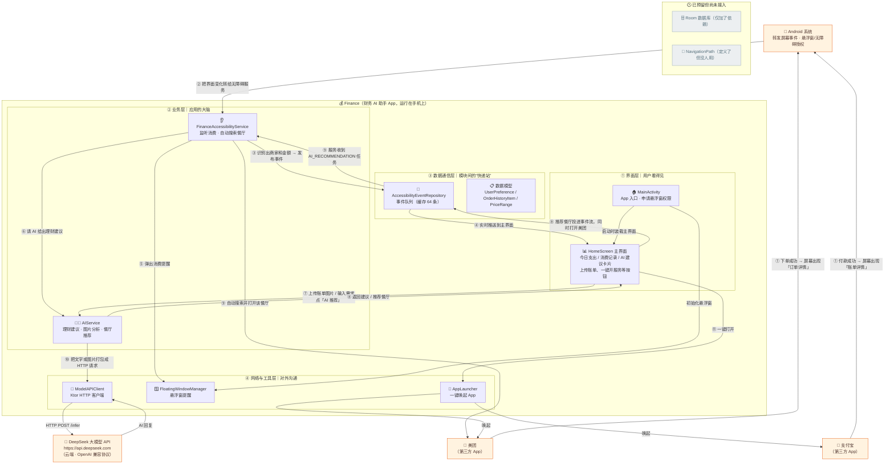

# Finance 项目架构分析

> 分析日期基于对当前仓库全部源码（`app/src/main/java` 下 13 个 Kotlin 文件）的逐一阅读与引用关系核对，非 README 转述。

## 一、项目是什么（一句话）

一款 **Android 财务助手 App（Kotlin + Jetpack Compose）**：通过系统「无障碍服务」自动读取支付宝 / 美团付款页上的文字，识别出商家和金额后实时展示、累计今日支出，并调用**本地 AI 大模型**（`http://127.0.0.1:8000`）生成理财建议；AI 还能按用户口味推荐餐厅，并借助无障碍能力在美团里**自动搜索**该餐厅。

## 二、仓库结构

```
Finance/
├── settings.gradle.kts / build.gradle.kts     # Gradle 根配置（单模块项目）
├── gradle/libs.versions.toml                  # 依赖版本统一目录（AGP/Kotlin/Compose/Room 等）
├── gradle/ gradlew*                           # Gradle Wrapper
└── app/                                       # 唯一的应用模块 :app
    ├── build.gradle.kts                       # 应用构建脚本（依赖清单）
    └── src/
        ├── main/
        │   ├── AndroidManifest.xml            # 注册入口 Activity + 无障碍服务 + 权限
        │   ├── res/xml/accessibility_config.xml  # 无障碍监听范围（美团、支付宝）
        │   ├── res/                           # 图标 / 主题 / 文案
        │   └── java/com/example/finance/
        │       ├── ui/        MainActivity.kt · HomeScreen.kt · theme/
        │       ├── service/   FinanceAccessibilityService.kt
        │       ├── ai/        AIService.kt（含 AIAdvice）
        │       ├── data/      AccessibilityEventRepository.kt · UserPreference.kt · NavigationPath.kt
        │       ├── network/   ModelAPIClient.kt
        │       └── utils/     FloatingWindowManager.kt · AppLauncher.kt
        ├── test/                              # 单元测试（示例）
        └── androidTest/                       # 仪器化测试（示例）
```

## 三、模块职责与真实依赖关系

| 层 | 文件（模块） | 干什么 | 依赖谁（真实引用，代码核对） |
|---|---|---|---|
| 界面层 UI | `MainActivity` | App 唯一入口；装载 Compose 界面；申请悬浮窗权限 | HomeScreen、FloatingWindowManager、theme |
| 界面层 UI | `HomeScreen` | 今日支出合计、实时消费记录、AI 建议卡片、上传账单图片、AI 外卖推荐、各控制按钮 | **订阅** Repository 事件流、AIService、AppLauncher |
| 业务层 | `FinanceAccessibilityService` | 系统回调监听美团/支付宝界面 → 正则提取金额商家 → 发事件；订阅 AI 推荐任务并**自动在美团搜索**（控件查找/剪贴板粘贴/坐标兜底） | Repository、AIService、FloatingWindowManager |
| 业务层 | `AIService` | 组装提示词，三种能力：消费建议 / 图片账单分析 / 餐厅推荐；用 SharedFlow 向界面广播 `AIAdvice` | ModelAPIClient |
| 通信层 | `AccessibilityEventRepository`（单例） | 全 App 的**事件总线**：`MutableSharedFlow` 缓存 64 条事件 | 无（被各层订阅/投递） |
| 通信层 | `UserPreference` / `OrderHistoryItem` / `PriceRange` | 用户口味数据模型（当前是代码内**写死的演示数据**） | 无 |
| 网络层 | `ModelAPIClient`（单例） | DeepSeek（OpenAI 兼容 chat/completions）客户端：API Key/模型/地址可配置，文本走云端，图片走视觉消息格式 | 无 |
| 工具层 | `FloatingWindowManager` | 用 WindowManager + ComposeView 弹「消费提醒」悬浮窗，含 MIUI 适配 | 无 |
| 工具层 | `AppLauncher` | Intent 一键唤起美团 / 饿了么 / 支付宝 | 无 |

**关键发现（与 README 不符 / 未接入的部分）：**
1. `NavigationPath.kt` —— 定义了 `NavigationPath` 数据类，**全仓库无任何引用**（预留）。
2. Room 数据库 —— `build.gradle.kts` 已引入 `room-runtime/ktx/compiler`，但**没有任何 Entity/DAO/Database 代码**，README 中「Room 本地存储」尚未落地。
3. 用户偏好 `UserPreference` 在 Service 与 HomeScreen 中均为**硬编码**，无持久化。
4. AI 服务地址固定为 `127.0.0.1:8000`（模拟器/本机回环），且 Manifest 开启了 `usesCleartextTraffic`。
5. 事件格式靠字符串前缀约定（`[CONSUMPTION]` / `[AI_RECOMMENDATION]`），无强类型。

## 四、架构图（Mermaid）



## 五、给外行看的读图顺序

1. **①** 你（用户）在支付宝或美团里付款 —— 屏幕上出现付款成功页。
2. **②** Android 系统把「页面文字变了」这件事交给本 App 注册的**无障碍服务**。
3. **③～④** 无障碍服务像人一样读屏，提取出「在哪家店、花了多少钱」，投进**事件队列**，主界面收到后累加到「今日支出」并显示记录。
4. **⑤～⑥** 同时弹出**悬浮窗提醒**，并把这笔消费发给 **AI 助手**要一句理财建议。
5. **⑦～⑧** 你也可以主动上传账单图片让 AI 分析，或输入「想吃辣的」让 AI 推荐餐厅；结果回到主界面展示。
6. **⑨** 推荐出餐厅后，事件队列把任务交回无障碍服务，它**自动打开美团并搜索这家餐厅**。
7. **⑩** 所有 AI 提问都经 **ModelAPIClient** 走本机网络到 `127.0.0.1:8000` 的本地大模型服务。
8. **⑪** 界面上的「打开支付宝 / 打开美团」按钮则直接经 **AppLauncher** 唤起对应 App。

> 灰色模块（Room、NavigationPath）为预留但未接入代码的部分 —— 图上没有连线，表示它们还没有真正参与工作。

## 六、按《理伴商业计划书》的技术路线对齐（本轮迭代记录）

计划书的目标是 12 个月、多模型重工程；本轮的策略是**把路线图的架构骨架落成可编译、可运行、可演示的"对齐步"**，为后续接入重模型预留清晰接口位。

| 路线图层 | 计划书设想 | 本轮落地（真实代码） |
|---|---|---|
| 感知层 | 结构化情境感知 | `data/FinanceModels.kt`：强类型 `ConsumptionRecord`（来源/商家/金额/时刻/时段标签），取代裸字符串事件协议；仓库拆为 `records`（强类型）与 `events`（指令）双通道 |
| 决策层 | 云边分级路由、端侧兜底 | `ai/AIService.kt`：云端调用统一 15s 超时，不可达自动降级**端侧启发式规则**（支出归类 + 定式建议、偏好餐厅轮换推荐），产出均标注来源「云端/端侧」 |
| 执行层 | Human-in-the-loop、助推 | `ui/HomeScreen.kt` + `data/UserSettings.kt`：AI 推荐后**默认不自动打开美团**，结果先展示、用户点「去美团搜索」才执行；全自动需显式打开持久化开关 |
| 学习层 | 反馈闭环 | 建议来源/消费/执行事件全部走统一日志通道（logcat + UI 系统日志），作为后续"接受/忽略"反馈管线的数据入口 |
| 隐私底座 | 数据主权 | `data/DemoProfile.kt` 收敛用户偏好单点数据源；界面明示"数据仅存本机，不上传"并提供一键清空 |

**测试基础设施**：`debug/DebugReceiver.kt`（导出 receiver，发布前删除）——无需 UI 点击，`adb shell am broadcast` 即可驱动模拟消费/AI 建议，配合 `FinanceUI`/`FinanceTest` 日志 tag 可脚本化验收（已在雷电 Android 9 上实测：`感知记录: 本地演示|沙县小吃|28.5|晚上`、云端不可达时自动输出 `AI建议[端侧]`）。

**验证环境说明**：雷电模拟器连接 `adb connect 127.0.0.1:5555`；ADB 无法直接点按 UI（LDPlayer 系统悬浮框架持有输入焦点），界面交互请在可见的雷电窗口人工操作或用上述广播驱动。

**后续接入点（预留）**：OCR/UI 定位模型 → `service/FinanceAccessibilityService` 解析段；端侧小模型 → `AIService.localConsumptionAdvice/localRecommendation`；云端大模型 → `ModelAPIClient`（地址/BuildConfig 化）；干预强度与反馈 → `UserSettings` + 建议日志。
